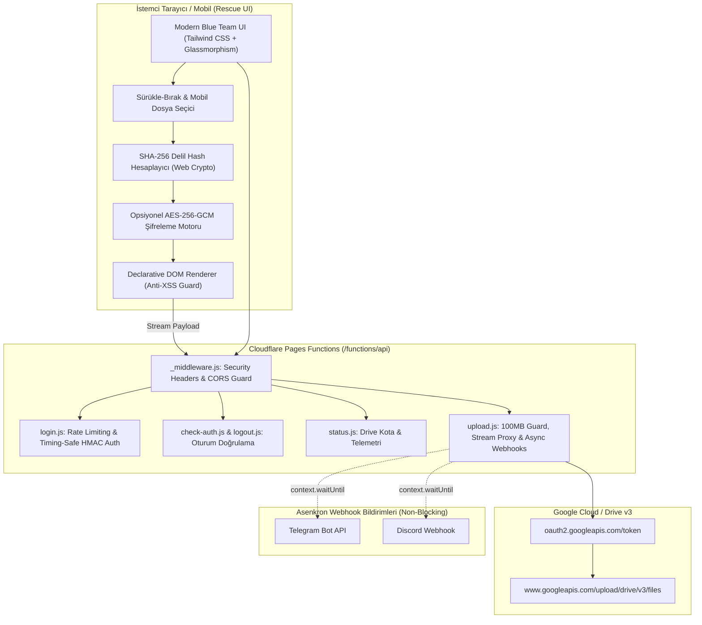

# Implementation Plan: Cloudflare Pages + Google Drive Rescue Vault (Hardened)

## Goal Description
Acil durum müdahale (Incident Response), sızma testi, forensic triage ve Blue Team operasyonlarında hedef makineden veya mobil cihazdan delilleri, logları, bellek dökümlerini ve kritik dosyaları **tek tıkla / sürükle-bırak** yöntemiyle doğrudan **ücretsiz kişisel Google Drive (15 GB)** hesabına aktaran, **%100 Always Free** bulut tabanlı bir acil durum kasası geliştirmek.

Sistem tek yönetici (single admin) parolalı giriş ekranına sahip olacak, tarayıcıda delil bütünlüğü için SHA-256 hash hesaplayacak, istenirse dosya Google'a gitmeden tarayıcıda sıfır bilgi (Zero-Knowledge) AES-256-GCM ile şifrelenecek, mobil cihazlarda dokunmatik dosya/kamera seçimi sunacak ve her yüklemede opsiyonel Telegram/Discord webhook bildirimleri gönderecektir.

---

## User Review Required

> [!IMPORTANT]
> **Google Cloud Console OAuth 2.0 Kurulumu:**
> Kişisel 15 GB Gmail hesaplarında Service Account'lar 0 bayt kota kısıtlamasına takıldığı için sistem **Google OAuth 2.0 Web/Desktop Client** ve `refresh_token` mimarisiyle çalışır.
> - Google Cloud Console'da ücretsiz bir proje açıp Drive API'yi etkinleştirmeniz gerekecek.
> - Projede hazırlayacağımız `scripts/get-refresh-token.js` aracını tek seferlik çalıştırarak Google hesabınızla giriş yapıp `refresh_token` üreteceksiniz.
> - Bu değer Cloudflare Pages Secrets/Environment Variables içine eklenecektir.

> [!NOTE]
> **Cloudflare Pages Ücretsiz Plan Limitleri:**
> Cloudflare Pages Functions ücretsiz planında maksimum istek gövdesi (request body) sınırı **100 MB**'tır. Taktik rescue/IR dosyaları (loglar, dump'lar, config'ler, script'ler, pcap parçaları) için bu sınır fazlasıyla yeterlidir.

---

## Open Questions

> [!NOTE]
> 1. Dosya şifreleme (AES-256-GCM) varsayılan olarak **kapalı** gelip bir switch ile isteğe bağlı mı açılsın, yoksa acil durum güvenliği için varsayılan olarak **açık** mı gelsin? (Varsayılan olarak arayüzde bir anahtar ile opsiyonel bırakılmıştır).
> 2. Telegram veya Discord webhook bildirimleri kullanılmadığında (boş bırakıldığında) sistem sessizce atlayıp ana yükleme akışını kesintisiz tamamlar.

---

## Proposed Changes



---

### Proje Yapılandırması ve Bağımlılıklar

#### [NEW] package.json
Proje metadata'sı, yerel geliştirme ve test komutları:
```json
{
  "name": "project-gdrive-rescue-vault",
  "version": "1.0.0",
  "type": "module",
  "scripts": {
    "dev": "wrangler pages dev public",
    "auth:token": "node scripts/get-refresh-token.js",
    "decrypt": "node scripts/decrypt-tool.js",
    "test": "node --test tests/*.test.js"
  },
  "devDependencies": {
    "wrangler": "^4.147.0"
  }
}
```

#### [NEW] wrangler.toml
Cloudflare Pages ve ortam yapılandırması:
```toml
name = "gdrive-rescue-vault"
compatibility_date = "2024-09-01"
pages_build_output_dir = "public"

[vars]
GDRIVE_FOLDER_ID = ""
DISCORD_WEBHOOK_URL = ""
TELEGRAM_BOT_TOKEN = ""
TELEGRAM_CHAT_ID = ""
```

#### [NEW] .env.example
Gerekli ortam değişkenleri ve sırların (secrets) şablonu:
```env
# Cloudflare / Sistem Güvenliği
ADMIN_PASSWORD=SizinSuperGuvenliSifreniz
JWT_SECRET=Rastgele64KarakterlikGizliAnahtar

# Google Drive OAuth 2.0
GDRIVE_CLIENT_ID=xxxxxx.apps.googleusercontent.com
GDRIVE_CLIENT_SECRET=GOCSPX-xxxxxx
GDRIVE_REFRESH_TOKEN=1//0xxxxxx
GDRIVE_FOLDER_ID=1xxxxxxxxxxxxxxxxxxxxxxxxx (Opsiyonel: Boş bırakılırsa ana dizine yükler)

# Bildirim Kanalları (Opsiyonel)
DISCORD_WEBHOOK_URL=https://discord.com/api/webhooks/xxxx/xxxx
TELEGRAM_BOT_TOKEN=123456:ABC-DEF1234ghIkl-zyx57W2v1u123ew11
TELEGRAM_CHAT_ID=123456789
```

---

### Yardımcı ve Adli Bilişim Araçları (Scripts)

#### [NEW] scripts/get-refresh-token.js
Kullanıcının tek komutla yerel bir localhost HTTP sunucusu açarak Google'dan `refresh_token` almasını sağlayan sıfır bağımlılıklı Node.js scripti.

#### [NEW] scripts/decrypt-tool.js
Arayüzden AES-256-GCM ile şifrelenip indirilen `.enc` uzantılı delil dosyalarını yerel terminalde tek komutla açabilen Node.js CLI aracı. Dosya başlığındaki Salt (16B) ve IV (12B) alanlarını okuyarak PBKDF2 ile anahtar türetir ve veriyi doğrular.

---

### Cloudflare Pages Backend API (functions/api/)

#### [NEW] functions/api/_middleware.js
- Tüm API yanıtlarına güvenlik başlıklarını ekler:
  - `X-Content-Type-Options: nosniff`
  - `X-Frame-Options: DENY`
  - `Referrer-Policy: strict-origin-when-cross-origin`
- İstemci ile iletişimde güvenli CORS ve hata yakalama katmanı sağlar.

#### [NEW] functions/api/login.js
- İstemciden gelen parolayı Web Crypto API (SHA-256) ile hash'ler.
- `ADMIN_PASSWORD` ile timing-safe (`crypto.subtle.timingSafeEqual`) karşılaştırma yapar.
- Başarısız girişimlere karşı gecikmeli yanıt (anti brute-force deterrent) uygular.
- Başarılıysa HMAC-SHA256 ile imzalı, `HttpOnly; Secure; SameSite=Strict; Path=/; Max-Age=86400` özellikli `rescue_session` çerezi döner.

#### [NEW] functions/api/logout.js
- `rescue_session` çerezini `Max-Age=0` yaparak oturumu güvenli şekilde sonlandırır.

#### [NEW] functions/api/check-auth.js
- İstekle gelen çerezin imzasını ve geçerlilik süresini doğrular, oturum durumunu JSON döner.

#### [NEW] functions/api/status.js
- Geçerli oturumu doğrular.
- Google Drive `about.get` API'sini çağırarak toplam depolama, kullanılan depolama ve kalan boş alanı (15 GB kotasını) çeker.
- Webhook aktiflik ve sistem telemetri durumlarını bildirir.

#### [NEW] functions/api/upload.js
- `rescue_session` çerezini doğrular.
- **100 MB Gövde Sınırı Kontrolü**: `Content-Length` veya akış boyutu 100 MB'ı aşıyorsa anında `413 Payload Too Large` döner.
- Gelen `multipart/form-data` gövdesinden dosyayı, SHA-256 delil özetini ve şifreleme bayrağını alır.
- Dosya adını adli güvenliği bozmayacak şekilde sanitize eder (kontrol karakterlerini ve tehlikeli yolları temizler).
- `GDRIVE_CLIENT_ID`, `GDRIVE_CLIENT_SECRET` ve `GDRIVE_REFRESH_TOKEN` kullanarak Google'dan taze bir `access_token` alır.
- Google Drive v3 Resumable/Multipart Upload endpoint'ine dosyayı aktarır (`description` alanına SHA-256 ve adli zaman damgasını işler).
- **Asenkron / Non-Blocking Webhook Dağıtımı**:
  - `context.waitUntil` mekanizması ile Discord ve Telegram bildirimlerini arka planda ateşler; böylece webhook gecikmesi yükleme yanıtını yavaşlatmaz.
- İstemciye başarı durumunu ve Google Drive dosya ID/bağlantısını döner.

---

### Taktik Ön Yüz (Frontend - public/)

#### [NEW] public/index.html
- Tek Sayfa (SPA) mimarisi.
- Koyu mod (Deep Slate / Dark Charcoal / Cyber Blue / Crimson panic accent).
- Ekranlar:
  1. **Taktik Giriş Ekranı (Restricted Access):** Şifreli giriş, hata gösterimi, klavye kısayolu (Enter ile giriş).
  2. **Rescue Dashboard:**
     - **Header:** Sistem durumu, Google Drive canlı kota göstergesi (progress bar), "Panic Wipe" (Acil Durum Çıkışı) butonu.
     - **Taktik Kontrol Barı:** "Zero-Knowledge AES Şifreleme" toggle anahtarı ve parola giriş kutusu.
     - **Dropzone (Yükleme Alanı):** Masaüstünde sürükle-bırak animasyonları, mobilde dokunmatik dosya yöneticisi / kamera tetikleme butonu.
     - **Canlı Yükleme Kartı:** Yüklenen dosya adı, boyutu, hesaplanan SHA-256 delil özeti, yükleme yüzdesi ve hız animasyonu.
     - **Adli Aktivite Geçmişi (Incident Log):** Oturum boyunca yüklenen dosyaların listesi, hash'leri, Drive bağlantıları ve kopyalama butonları.

#### [NEW] public/style.css
- Glassmorphism (arkaplan bulanıklığı, şeffaf paneller).
- Siber güvenlik / Taktik Blue Team renk paleti.
- Mobil dokunmatik optimizasyonlar (minimum 48px dokunma hedefleri, responsive düzen, iOS/Android güvenli alan uyumu).
- Pürüzsüz sürükle-bırak nabız/vurgu animasyonları.

#### [NEW] public/app.js
- **Oturum Yönetimi:** Çerez kontrolü, otomatik yönlendirme.
- **Web Crypto Motoru:**
  - `crypto.subtle.digest('SHA-256', buffer)` ile dosyanın delil bütünlük özetini anında hesaplama.
  - `crypto.subtle.encrypt({ name: 'AES-GCM', iv }, key, data)` ile PBKDF2 üzerinden 256-bit AES şifreleme ve Salt + IV + Şifreli Veri paketleme.
- **Sürükle-Bırak & Otomatik Yükleme Mantığı:** Dosya bırakıldığı an kuyruğa alma, SHA-256 hesaplama, gerekirse şifreleme ve `/api/upload` endpoint'ine XMLHttpRequest / Fetch ile stream etme (canlı `progress` event'leri ile % göstergesi).
- **Anti-String-DOM / DOM-XSS Koruması**: Dosya adları, hata mesajları ve adli hash özetleri DOM'a basılırken asla `innerHTML` veya dizgi birleştirme kullanılmaz; daima `textContent` ve `createElement` ile render edilir.
- **Panic Wipe Fonksiyonu:** Tek tıkla yerel DOM geçmişini silme, `/api/logout` çağırma, oturumu sonlandırma ve tarayıcıyı temizleme.

---

## Verification Plan

### Automated Tests
Node.js yerleşik test çalıştırıcısı (`node --test`) ile güvenlik ve şifreleme rutinlerini doğrulayan otomatik testler (`tests/crypto.test.js`, `tests/auth.test.js`):
```bash
pnpm test
```
* Doğrulanacaklar:
  - SHA-256 hash çıktısının standart adli araçlarla birebir eşleşmesi.
  - AES-256-GCM tarayıcı şifreleme ve Node.js CLI deşifreleme (`scripts/decrypt-tool.js`) döngüsünün tam ve kayıpsız çalışması.
  - Oturum token'ı (HMAC imzalama ve doğrulama) kontrolleri.
  - Timing-safe eşitlik testi.

### Manual Verification
1. **Yerel Wrangler Testi:**
   ```bash
   pnpm run dev
   ```
2. **Giriş Ekranı Doğrulaması:**
   - Hatalı parola girildiğinde erişimin engellendiğinin ve timing-safe korumasının doğrulanması.
   - Doğru parola ile dashboard'a geçilmesi ve `HttpOnly` çerezin oluştuğunun teyit edilmesi.
3. **Masaüstü Sürükle-Bırak:**
   - Bir dosya sürüklenip bırakıldığında anında SHA-256 özetinin ekrana basılması ve yükleme barının %100'e ulaşması.
4. **Mobil Cihaz / Görünüm:**
   - Tarayıcı geliştirici araçlarında mobil boyutuna geçildiğinde dokunmatik alanın sorunsuz dosya seçimi yaptırması.
5. **AES-256-GCM Şifreleme Testi:**
   - Şifreleme anahtarı girilip yüklenen bir dosyanın Google Drive'a `.enc` olarak gitmesi ve `scripts/decrypt-tool.js` ile orijinal haliyle deşifre edilebilmesi.
6. **Panic Wipe Butonu:**
   - Tıklandığında ekrandaki geçmişin anında silinmesi ve oturumun anında kilitlenerek giriş ekranına dönülmesi.

---

### Audit Notes
* **Sentinel Plan Audit Tarafından Uygulanan Güvenlik Sertleştirmeleri:**
  1. **Güvenlik Başlıkları Middleware'i Eklendi (`_middleware.js`):** `X-Content-Type-Options: nosniff`, `X-Frame-Options: DENY` başlıkları zorunlu hale getirildi.
  2. **Cloudflare 100 MB Gövde Sınırı Koruyucusu Eklendi:** `/api/upload` endpoint'ine 100 MB üzeri istekleri 413 kodu ile derhal durduran kontrol eklendi.
  3. **Non-Blocking Webhook Mimarisi (`context.waitUntil`):** Discord ve Telegram bildirimlerinin yükleme akışını kilitlemesini önlemek amacıyla asenkron arka plan yürütmesi zorunlu kılındı.
  4. **Anti-String-DOM & DOM-XSS Standartı Eklendi:** Zararlı dosya adlarının XSS saldırısına dönüşmesini engellemek için `public/app.js` içerisindeki tüm dinamik gösterimlerde `innerHTML` yasaklandı, `textContent` ve `createElement` deklaratif render zorunlu kılındı.
  5. **Adli Zaman Damgası ve Metadata Sanitizasyonu:** Dosya adlarındaki gizli kontrol karakterlerinin Google Drive'a gitmeden temizlenmesi kuralı eklendi.
